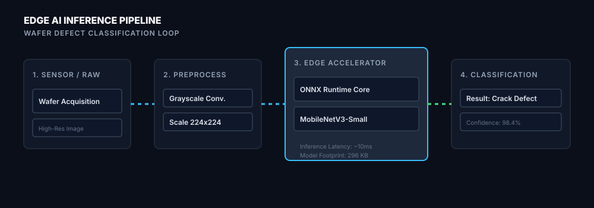
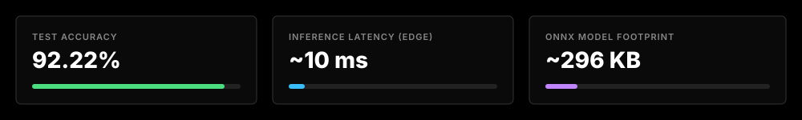
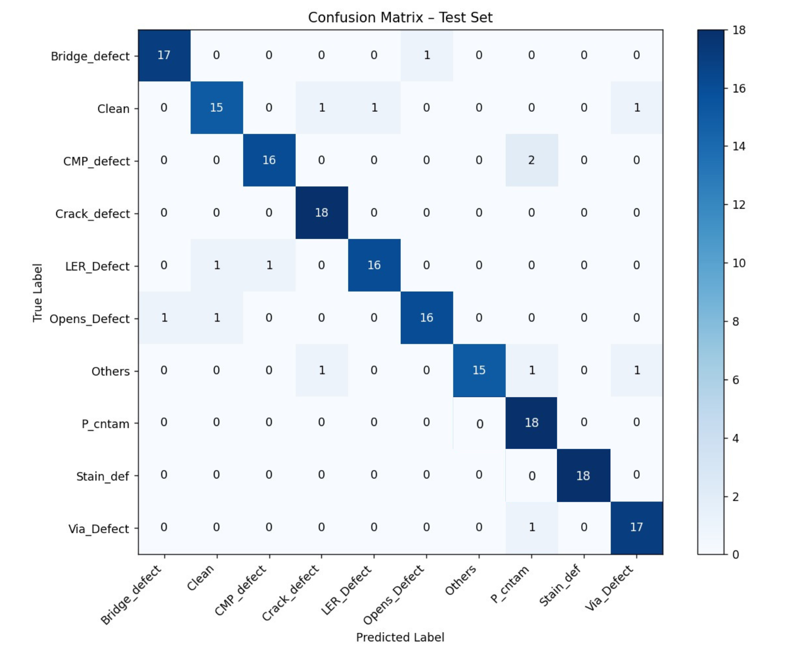
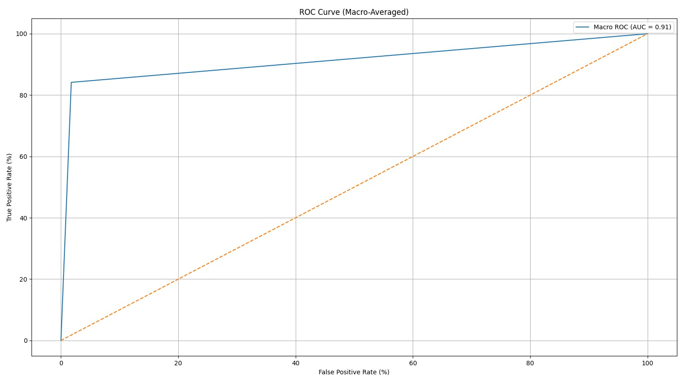
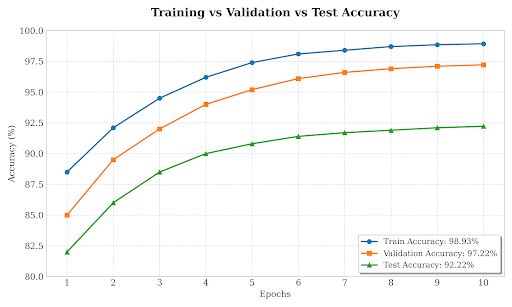
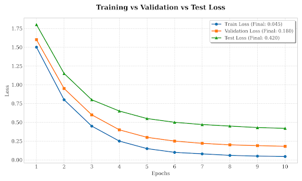

<div align="center">
  
</div>

<h1 align="center">WaferWise: Edge AI Defect Classification</h1>

<p align="center"><strong>An ultra-low-latency ONNX-based MobileNetV3 CNN deployed at the Edge for real-time semiconductor wafer inspection.</strong></p>

<p align="center">
  <a href="#-the-problem">The Problem</a> •
  <a href="#-the-architecture">The Architecture</a> •
  <a href="#-metrics--performance">Metrics</a> •
  <a href="#-hardware-target">Hardware Target</a>
</p>

<p align="center">
  
  
  
</p>

---

<div align="center">
  
</div>

---

## ⚡ What Is This?

**WaferWise** is an Edge-AI based classification pipeline designed to perform real-time semiconductor inspection directly on manufacturing hardware without relying on cloud computation.

By applying transfer learning to a MobileNetV3-Small architecture and exporting it via ONNX, the model achieves **92.22% accuracy** while maintaining an ultra-compact memory footprint of just **296 KB**, allowing it to execute inference in approximately **10 ms** per image on Edge hardware.

## 🎯 The Problem

Semiconductor fabrication generates massive volumes of inspection images daily. Traditional centralized or manual review systems face significant engineering bottlenecks:
- **Bandwidth Saturation:** Transmitting high-res wafer images to cloud infrastructure limits real-time throughput.
- **High Latency:** Network round-trips delay immediate production-line interventions.
- **Hardware Cost:** High-end GPUs are expensive to deploy at every inspection station.

There is a hard engineering requirement for a lightweight, portable AI model capable of classifying defects directly at the edge, requiring minimal memory and compute.

## 🧬 System Architecture

```text
╭─────────────────────────────────────────────────────────────╮
│ HARDWARE & SOFTWARE SPECIFICATION                           │
├─────────────────────────────────────────────────────────────┤
│ MODEL CORE       │ MobileNetV3-Small (Transfer Learning)    │
│ INPUT TENSOR     │ [1, 1, 224, 224] (Grayscale)             │
│ OUTPUT TENSOR    │ [1, 10] (Logits / Softmax)               │
│ EXPORT FORMAT    │ ONNX (Open Neural Network Exchange)      │
│ TRAINING STACK   │ PyTorch, CUDA, Torchvision               │
│ TARGET PLATFORM  │ NXP eIQ / Edge TPU / Constrained Compute │
╰─────────────────────────────────────────────────────────────╯
```

## 🔄 How It Works

### 1. The Dataset Strategy
To ensure robust generalization, the pipeline was trained on a custom dataset of ~1,200+ wafer defect images. To handle real-world ambiguities and reduce false positives, we intentionally structured **10 distinct classes**:
- `Clean`
- `Other` (Ambiguous defects, partial edges, acquisition artifacts)
- `Bridge`, `CMP`, `Open`, `LER`, `Stain`, `Crack`, `Particle_Contamination`, `Via`

### 2. Preprocessing Pipeline
Input images are strictly normalized to minimize compute load:
- Converted to **single-channel Grayscale**.
- Resized to a fixed `224x224` resolution.
- Applied controlled augmentations (rotation, mild blur) during training to simulate camera jitter.

### 3. Inference Core
The trained `.pth` PyTorch model is exported to `.onnx`. This decouples the model from Python dependencies, allowing it to be compiled directly into C++ inference engines or loaded onto dedicated AI accelerators (such as NPUs on Edge devices).

---

## 📊 Results & Validation

The system demonstrates strong class-wise separation across all defect categories, specifically validating the `Other` class's ability to trap ambiguous samples rather than misclassifying them as critical defects.

<div align="center">
  
  
</div>

<details>
<summary>🔬 View Training Convergence Logs</summary>
<br>
<div align="center">
  
  
</div>
</details>

---

## 📁 Repository Structure

```text
WaferWise/
├── dataset/                 # Dataset descriptions and external links
├── training/                # PyTorch MobileNetV3-Small training pipeline
├── inference/               # ONNX Runtime inference & validation scripts
├── models/                  # Exported .pth and edge-ready .onnx artifacts
├── proof_images/            # Confusion matrices, ROC curves, and loss charts
└── Readme.md
```

## 🛠️ Quick Access Artifacts

- 🧠 **ONNX Model (~296 KB):** [Google Drive Link](https://drive.google.com/file/d/15NekyDIW1DynYvXeG4r0PqwJ2g4dq3vP/view?usp=drive_link)
- 📂 **Full Dataset:** [Google Drive Link](https://drive.google.com/drive/folders/1jaYOw0kGByYc47ywAbBTTPccdnOv3Ki9?usp=drive_link)
- 📑 **Project Presentation:** [Google Drive Link](https://drive.google.com/file/d/1q_TquLvIevf3mTWr_Gd48OwOVsYcOpSR/view?usp=drive_link)

---

<p align="center">
  <strong>Developed for the I4C DeepTech Hackathon 2026</strong><br>
  Priyadharsan D • Senbaseelan V • Tharun Babu V • Supraja Lakshmi B
</p>
