<!--
██████╗ ██████╗ ██╗██████╗  █████╗ ██╗   ██╗
██╔══██╗██╔══██╗██║██╔══██╗██╔══██╗██║   ██║
██████╔╝██████╔╝██║██║  ██║███████║██║   ██║
██╔═══╝ ██╔══██╗██║██║  ██║██╔══██║██║   ██║
██║     ██║  ██║██║██████╔╝██║  ██║╚██████╔╝
╚═╝     ╚═╝  ╚═╝╚═╝╚═════╝ ╚═╝  ╚═╝ ╚═════╝
-->

  

  
  
  
  

---
## 🔗 Quick Access

- 📂 Dataset: [[Google Drive Link](https://drive.google.com/drive/folders/1jaYOw0kGByYc47ywAbBTTPccdnOv3Ki9?usp=drive_link)]
- 🧠 ONNX Model (~293 KB): [[Drive Link](https://drive.google.com/file/d/1mVV39pQ_re-IcLTrn-lj6TT7kFtDbGKh/view?usp=drive_link)]
- 📁 Complete Project Artifacts (Dataset + ONNX Model + Source Code)  
  👉 [[Google Drive – Full Access Folder Link](https://drive.google.com/drive/folders/1Atj94_75VKlZoFJyq0if6iPj1cTrWbvc?usp=drive_link)]
- 📊 **Dataset**
  - [`dataset/`](./dataset) – Dataset description, class definitions, and download links
- 🏋️ **Model Training**
  - [`training/`](./training) – PyTorch training pipeline for MobileNetV3-Small
- 🧠 **Trained Models**
  - [`models/`](./models) – Trained `.pth` and `.onnx` model artifacts
- ⚡ **Edge Inference**
  - [`inference/`](./inference) – ONNX Runtime inference and validation scripts
---

## 📌 Project Overview

Our project presents an Edge-AI based wafer defect classification system designed to perform real-time semiconductor inspection directly on edge devices.

The solution leverages a lightweight MobileNetV3-Small CNN model trained on a custom dataset of wafer defect images across 10 classes (including Clean and Other).

The trained model is exported to ONNX format for compatibility with NXP eIQ deployment flow, ensuring portability, low latency (~10 ms inference), and compact model size (<1 MB).

The system addresses latency, bandwidth, and scalability limitations of centralized inspection by enabling efficient on-device AI inference suitable for Industry 4.0 manufacturing environments.

---

## Problem Understanding

Semiconductor fabrication generates massive volumes of inspection images daily. Traditional centralized or manual review systems face:

High analysis latency

Heavy cloud/infrastructure dependency

Bandwidth bottlenecks

Poor scalability for real-time throughput

There is a need for a lightweight, portable, and high-accuracy AI model capable of performing defect classification directly at the edge while maintaining compute efficiency

---

## Dataset Strategy

To meet hackathon requirements and ensure strong generalization, we built a custom wafer inspection dataset.

### 📌 Data Collection

- Collected wafer defect images from publicly available semiconductor datasets and research references

- Included Clean, Other, and 8 distinct defect classes

- Total dataset size: ~1,200+ images (well-balanced)

### 📌 Preprocessing

- Converted all images to grayscale (single-channel)

- Resized to 224 × 224

- Stored in PNG format

Applied controlled augmentations (rotation, mild blur)

### 📌 Dataset Structure

- Dataset organized using structured class-wise directories for training and validation

- Folder-based labeling for supervised learning

- Ensured balanced class distribution

---

## Model Development

### 📌 Architecture Selection

- Selected MobileNetV3-Small for lightweight edge-friendly design  
- Suitable for low-latency and small memory footprint  
- Transfer learning used for faster convergence  

### 📌 Training Setup

- Implemented using PyTorch  
- Multi-class classification (10 classes)  
- Trained with optimizer and cross-entropy loss  
- Batch size: 16 | Epochs: 30  

### 📌 Performance Monitoring

- Tracked training & validation accuracy  
- Monitored loss for stability  
- Generated confusion matrix for class-level evaluation

```mermaid
flowchart LR
    A[Wafer Dataset<br/>~1200+ Images] --> B[Preprocessing<br/>Grayscale • 224x224 • Augmentation]
    B --> C[MobileNetV3-Small<br/>Transfer Learning]
    C --> D[Training<br/>Batch Size 16 • 30 Epochs]
    D --> E[Validation<br/>82–85% Accuracy]
    E --> F[ONNX Export<br/>Edge-Ready Model]
```

---

## 🔹 Evaluation & Performance

Our MobileNetV3-Small based model was optimized for both accuracy and edge efficiency.  
The evaluation results demonstrate strong generalization while maintaining extremely low model size and latency — making it ideal for real-time fab deployment.

### 📊 Model Performance Summary

<table>
  <tr>
    <th>Metric</th>
    <th>Value</th>
  </tr>
  <tr>
    <td>Test Accuracy</td>
    <td>83–85%</td>
  </tr>
  <tr>
    <td>Precision (Macro Avg)</td>
    <td>~0.84</td>
  </tr>
  <tr>
    <td>Recall (Macro Avg)</td>
    <td>~0.83</td>
  </tr>
  <tr>
    <td>F1-Score (Macro Avg)</td>
    <td>~0.83</td>
  </tr>
  <tr>
    <td>Model Size (ONNX)</td>
    <td><b>293 KB</b></td>
  </tr>
  <tr>
    <td>Inference Time</td>
    <td>~10 ms / image</td>
  </tr>
  <tr>
    <td>Framework</td>
    <td>PyTorch → ONNX</td>
  </tr>
</table>

### 🧪 Model Evaluation Visuals

  

<table align="center" border="1" cellpadding="10" cellspacing="0">

  <!-- Row 1 -->
  <tr>
    <th align="center">Training Accuracy</th>
    <th align="center">Training Loss</th>
  </tr>
  <tr>
    <td align="center">
      
    </td>
    <td align="center">
      
    </td>
  </tr>

  <!-- Row 2 -->
  <tr>
    <th align="center">Confusion Matrix</th>
    <th align="center">F1 Score</th>
  </tr>
  <tr>
    <td align="center">
      
    </td>
    <td align="center">
      
    </td>
  </tr>

  <!-- Row 3 -->
  <tr>
    <th align="center">ROC Curve</th>
    <th align="center">Model Size Comparison</th>
  </tr>
  <tr>
    <td align="center">
      
    </td>
    <td align="center">
      
    </td>
  </tr>
</table>

### 📈 Observations

- Confusion matrix shows strong separation across major defect categories.  
- Lightweight model enables real-time inference under strict edge constraints.  
- Extremely compact size (293 KB) ensures easy portability to NXP eIQ flows.

---

## 💡 Innovation

- Lightweight MobileNetV3-Small architecture optimized for edge constraints  
- Extremely compact model size (~293 KB) without sacrificing multi-class performance  
- Designed for direct portability to NXP eIQ deployment flow  
- Edge-first design eliminating dependency on centralized cloud infrastructure  

---

## 🌍 Impact

This solution enables faster and more reliable semiconductor defect inspection by shifting intelligence directly to the edge.

- Reduces manual inspection dependency and human error  
- Enables near real-time wafer analysis (~10 ms/image)  
- Eliminates heavy cloud bandwidth requirements  
- Scales easily across multiple inspection stations  
- Low model size (~293 KB) minimizes hardware cost and memory usage  

By combining accuracy with ultra-lightweight deployment, the system supports Industry 4.0 manufacturing environments with practical, scalable AI.

---

## 👥 Team

  <strong>I4C DeepTech Hackathon 2026</strong>

<table align="center">
  <tr>
    <td align="center">
      <a href="https://github.com/PRIY4DH4RS4N-D">
        <strong>Priyadharsan D</strong>
      </a> 
    </td>
    <td align="center">
      <a href="https://github.com/Senbagaseelan18">
        <strong>Senbaseelan V</strong>
      </a> 
    </td>
    <td align="center">
      <a href="https://github.com/TharunBabu-05">
        <strong>Tharun Babu V</strong>
      </a> 
    </td>
    <td align="center">
      <a href="https://github.com/SuprajaLakshmiB">
        <strong>Supraja Lakshmi B</strong>
      </a> 
    </td>
  </tr>
</table>

