<!--
██████╗ ██████╗ ██╗██████╗  █████╗ ██╗   ██╗
██╔══██╗██╔══██╗██║██╔══██╗██╔══██╗██║   ██║
██████╔╝██████╔╝██║██║  ██║███████║██║   ██║
██╔═══╝ ██╔══██╗██║██║  ██║██╔══██║██║   ██║
██║     ██║  ██║██║██████╔╝██║  ██║╚██████╔╝
╚═╝     ╚═╝  ╚═╝╚═╝╚═════╝ ╚═╝  ╚═╝ ╚═════╝
-->

  

  
  
  
  

---
## 🔗 Quick Access

- 📂 Dataset: [[Google Drive Link](https://drive.google.com/drive/folders/1jaYOw0kGByYc47ywAbBTTPccdnOv3Ki9?usp=drive_link)]
- 📑 PPT: [[Google Drive Link](https://drive.google.com/file/d/1q_TquLvIevf3mTWr_Gd48OwOVsYcOpSR/view?usp=drive_link)]
- 🧠 ONNX Model (~296 KB): [[Drive Link](https://drive.google.com/file/d/15NekyDIW1DynYvXeG4r0PqwJ2g4dq3vP/view?usp=drive_link)]
- 📁 Complete Project Artifacts (Dataset + ONNX Model + Source Code)  
  👉 [[Google Drive – Full Access Folder Link](https://drive.google.com/drive/folders/1Atj94_75VKlZoFJyq0if6iPj1cTrWbvc?usp=drive_link)]
- 📊 **Dataset**
  - [`dataset/`](./dataset) – Dataset description, class definitions, and download links
- 🏋️ **Model Training**
  - [`training/`](./training) – PyTorch training pipeline for MobileNetV3-Small
-    **Model Graph** [[Google Drive Link](https://drive.google.com/file/d/19aqrUpRzWng95ilgWcB5JqX_Id4UYDle/view?usp=drive_link)]
- 🧠 **Trained Models**
  - [`models/`](./models) – Trained `.pth` and `.onnx` model artifacts
- ⚡ **Edge Inference**
  - [`inference/`](./inference) – ONNX Runtime inference and validation scripts
---

## 📌 Project Overview

Our project presents an Edge-AI based wafer defect classification system designed to perform real-time semiconductor inspection directly on edge devices.

The solution leverages a lightweight MobileNetV3-Small CNN model trained on a custom dataset of wafer defect images across **10 classes** (including *Clean* and *Other*).

The trained model is exported to **ONNX format** for compatibility with the **NXP eIQ deployment flow**, ensuring portability, low latency (~10 ms inference), and an ultra-compact model size (~296 KB).

The system addresses latency, bandwidth, and scalability limitations of centralized inspection by enabling efficient on-device AI inference suitable for **Industry 4.0 manufacturing environments**.

---

## Problem Understanding

Semiconductor fabrication generates massive volumes of inspection images daily. Traditional centralized or manual review systems face:

- High analysis latency  
- Heavy cloud / infrastructure dependency  
- Bandwidth bottlenecks  
- Poor scalability for real-time throughput  

There is a need for a **lightweight, portable, and high-accuracy AI model** capable of performing defect classification directly at the edge while maintaining compute efficiency.

---

## Dataset Strategy

To meet hackathon requirements and ensure strong generalization, we built a **custom wafer inspection dataset**.

### 📌 Data Collection

- Collected wafer defect images from publicly available semiconductor datasets and research references  
- Included **Clean, Other, and 8 distinct defect classes**  
- Total dataset size: **~1,200+ images**  
- Balanced class distribution maintained  

### 📌 Defect Classes (10)

- Clean  
- Bridge  
- CMP  
- Open  
- LER  
- Stain  
- Crack  
- Particle_Contamination  
- Via  
- Other  

**Other class includes:**  
- Ambiguous defect patterns  
- Edge-partial defects  
- Image acquisition artifacts  
*(introduced intentionally to improve robustness and reduce false positives)*

### 📌 Preprocessing

- Converted all images to **grayscale (single-channel)**  
- Resized to **224 × 224**  
- Stored in PNG format  
- Applied controlled augmentations (rotation, mild blur)

### 📌 Dataset Structure

- Folder-based labeling for supervised learning  
- Separate **Train / Validation / Test** directories  
- **Test set:** 180 images (18 images × 10 classes)  

## Model Development
### 📌 Architecture Selection

- Selected MobileNetV3-Small for edge-friendly deployment

- Optimized for low latency and minimal memory footprint

- Transfer learning used for faster convergence

### 📌 Training Setup

- Framework: PyTorch

- Multi-class classification (10 classes)

- Loss: Cross-Entropy

- Batch size: 16

- Epochs: up to 50 (early stopping enabled)

### 📌 Performance Monitoring

- Tracked training & validation accuracy

- Early stopping to prevent overfitting

- Generated classification report & confusion matrix

Diagram

```mermaid
flowchart LR
    A[Wafer Dataset<br/>~1200+ Images] --> B[Preprocessing<br/>Grayscale • 224x224 • Augmentation]
    B --> C[MobileNetV3-Small<br/>Transfer Learning]
    C --> D[Training<br/>Batch Size 16 • Early Stopping]
    D --> E[Test Evaluation<br/>92.22% Accuracy]
    E --> F[ONNX Export<br/>Edge-Ready Model]
```

## 🔹 Evaluation & Performance

The trained model demonstrates strong generalization while remaining highly efficient for edge deployment.

📊 Model Performance Summary
<table> <tr> <th>Metric</th> <th>Value</th> </tr> <tr> <td>Best Training Accuracy</td> <td>98.93%</td> </tr> <tr> <td>Best Validation Accuracy</td> <td>97.22%</td> </tr> <tr> <td><b>Test Accuracy</b></td> <td><b>92.22%</b></td> </tr> <tr> <td>Precision (Macro Avg)</td> <td>~0.93</td> </tr> <tr> <td>Recall (Macro Avg)</td> <td>~0.92</td> </tr> <tr> <td>F1-Score (Macro Avg)</td> <td>~0.92</td> </tr> <tr> <td>Model Size (ONNX)</td> <td><b>~296 KB</b></td> </tr> <tr> <td>Inference Time</td> <td>~10 ms / image</td> </tr> <tr> <td>Framework</td> <td>PyTorch → ONNX</td> </tr> </table> 

🧪 Model Evaluation Visuals

  

<table align="center"> <tr> <th>Training Accuracy</th> <th>Training Loss</th> </tr> <tr> <td></td> <td></td> </tr> <tr> <th>Confusion Matrix</th> <th>F1 Score</th> </tr> <tr> <td></td> <td></td> </tr> <tr> <tr> <th>ROC Curve</th> <th>Model Size</th> </tr> <td></td> <td></td> </tr> </table>

## 📈 Observations

- Strong class-wise separation across all defect categories

- Robust handling of ambiguous samples via Other class

- Ultra-lightweight model suitable for constrained edge devices

  

## 💡 Innovation

- Edge-first design using MobileNetV3-Small

- Ultra-compact ONNX model (~296 KB)

- Explicit handling of ambiguous & artifact samples

- Designed for direct NXP eIQ portability

## 🌍 Impact

- Enables near real-time wafer inspection (~10 ms/image)

- Reduces dependency on centralized cloud analysis

- Low memory footprint reduces hardware cost

- Scales efficiently across multiple inspection stations

## 👥 Team

  <strong>I4C DeepTech Hackathon 2026</strong>

<table align="center">
  <tr>
    <td align="center">
      <a href="https://github.com/PRIY4DH4RS4N-D">
        <strong>Priyadharsan D</strong>
      </a> 
    </td>
    <td align="center">
      <a href="https://github.com/Senbagaseelan18">
        <strong>Senbaseelan V</strong>
      </a> 
    </td>
    <td align="center">
      <a href="https://github.com/TharunBabu-05">
        <strong>Tharun Babu V</strong>
      </a> 
    </td>
    <td align="center">
      <a href="https://github.com/SuprajaLakshmiB">
        <strong>Supraja Lakshmi B</strong>
      </a> 
    </td>
  </tr>
</table>

