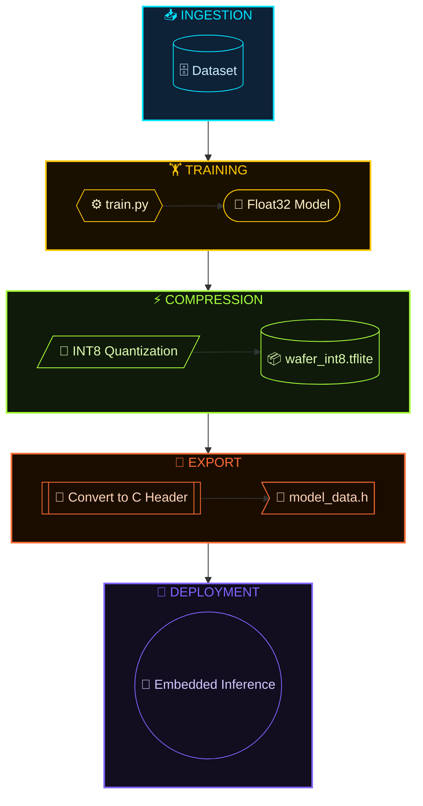
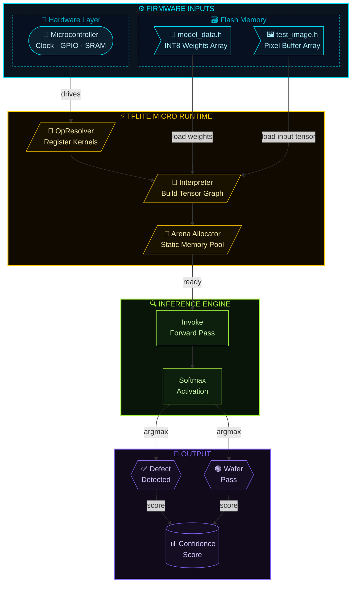

<p align="center">
  
</p>
<!--
██████╗ ██████╗ ██╗██████╗  █████╗ ██╗   ██╗
██╔══██╗██╔══██╗██║██╔══██╗██╔══██╗██║   ██║
██████╔╝██████╔╝██║██║  ██║███████║██║   ██║
██╔═══╝ ██╔══██╗██║██║  ██║██╔══██║██║   ██║
██║     ██║  ██║██║██████╔╝██║  ██║╚██████╔╝
╚═╝     ╚═╝  ╚═╝╚═╝╚═════╝ ╚═╝  ╚═╝ ╚═════╝
-->
<div align="center">

</div>

---

 - [`prediction/`](./logs/predictions_log.txt) – Prediction done in hotel at 10:25 PM

---

## 📌 Project Overview

- Trained a multi-class wafer defect classification model using 128×128 grayscale input (1-channel).
- Converted the trained model to TensorFlow Lite (.tflite) format.
- Applied INT8 quantization to reduce model size for edge deployment.
- Converted the optimized model into C header files for microcontroller integration.
- Demonstrated a complete Edge AI pipeline from training to embedded inference.
 <div align="center">
  
</div>

---

## 📊 Model Evaluation – Phase 3 Final (Float32)

- Evaluated on a 10% held-out test set containing 400 grayscale images across 11 wafer defect classes.
- Input shape: 128 × 128 × 1 (Grayscale), Output: 11-class softmax, Model size: 1970.5 KB.
- Achieved 91.25% overall accuracy (365/400) with a 91.3% weighted F1-score.
- Highest-performing classes: CLEAN_CRACK (100%), BRIDGE (100%), VIA (95.1%), CRACK (93.9%).
- Lowest-performing class: CLEAN_LAYER (78.8%), with minor confusion among visually similar defects.
- Confusion matrix shows strong diagonal dominance, indicating stable and reliable classification performance.
 <div align="center">
  
</div>
 <div align="center">
  
</div>

---

## 📌 Complete ML to Embedded Pipeline

The wafer defect model is trained using grayscale images and converted to TensorFlow Lite format.
It is optimized using INT8 quantization to reduce size and improve embedded performance.
Finally, the model is converted to a C header file and deployed for microcontroller-based inference.

---
## ⚙️ Embedded Deployment Architecture

- The quantized INT8 TFLite model is converted into a C header file (model_data.h).
- The model is integrated into the microcontroller firmware using TFLite Micro runtime.
- A grayscale input image (128×128×1) is converted into a C array (test_image.h).
- The microcontroller loads the model and input data into memory.
- On-device inference is executed without external computation.
- The predicted wafer defect class is generated in real time.


---
## 📂 Project Structure
```bash
phase3_task2/
│
├── train.py
├── wafer_classifier_float32.tflite
├── wafer_int8.tflite
├── model_data.h
├── model_labels.h
├── test.png
├── test_image.h
├── img_to_c.py
└── proof_images/
```
📊 Model Optimization Comparison
Model Type	Size	Accuracy	Deployment
Float32	~2.0 MB	High	Desktop
INT8	~694 KB	Slightly Reduced	Embedded MCU

🔄 Complete Workflow Animation Flow

```mermaid
sequenceDiagram
    autonumber

    participant Dev  as 👨‍💻 Developer
    participant Py   as ⚙️ Training Script<br/>(train.py)
    participant TFL  as 🔬 TFLite Converter
    participant MCU  as 🔲 Embedded Device<br/>(i.MX RT1170)

    rect rgb(10, 30, 50)
        Note over Dev,Py: 🏋️ Phase 1 — Model Training
        Dev  ->>+ Py  : Train Model (Keras / TensorFlow)
        Py   -->>- Dev : Float32 Model Weights saved
    end

    rect rgb(20, 15, 5)
        Note over Py,TFL: ⚡ Phase 2 — Quantization & Export
        Dev  ->>+ TFL : Convert model → .tflite
        TFL  ->>  TFL : INT8 Post-Training Quantization
        Note right of TFL: 4× smaller · faster inference
        TFL  -->>- Dev : wafer_int8.tflite ready
    end

    rect rgb(15, 5, 30)
        Note over Dev,TFL: 🔧 Phase 3 — C Header Generation
        Dev  ->>+ TFL : Run xxd / Python script
        TFL  -->>- Dev : model_data.h (uint8_t array)
    end

    rect rgb(5, 20, 5)
        Note over Dev,MCU: 🚀 Phase 4 — Firmware Deployment
        Dev  ->>+ MCU : Flash firmware (arm-none-eabi)
        Note right of MCU: BOARD_FLASH: 2.57% used<br/>Build: 0 errors · 5.1ms
        MCU  ->>  MCU : TFLite Micro — Invoke()
        MCU  -->>- Dev : Classification Output ✅
    end
```



---

## 📊 Model Comparison — Float32 vs INT8

> 📸 **Build verified on:** `evkbmimxrt1170` · NXP i.MX RT1170 · ARM Cortex-M7 · `arm-none-eabi-c++ 14.2.1`

| Attribute | 🔵 Float32 Model | 🟢 INT8 Quantized |
|-----------|:----------------:|:-----------------:|
| **Model Size** | ~2.0 MB | **~694 KB** ✅ |
| **Size Reduction** | baseline | **~65% smaller** 🔽 |
| **Accuracy** | High (reference) | Slightly reduced ≈ −1–2% |
| **Precision** | 32-bit float | 8-bit integer ||
| **Deployment Target** | Desktop / Server | **Embedded MCU** 🔲 |
| **Framework** | TensorFlow | **TFLite Micro** ||

---

## 🏗️ Actual Build Report — `evkbmimxrt1170`

> Captured from MCUXpresso IDE build console · `Build Finished: 0 errors, 1 warning · 5.101ms`

### 🧮 Binary Segment Sizes

```
 Segment     Size        Description
─────────────────────────────────────────────────
 .text       903,216 B   Code + read-only data (Flash)
 .data       819,328 B   Initialized globals (Flash → SRAM)
 .bss         41,648 B   Zero-initialized globals (SRAM)
─────────────────────────────────────────────────
 TOTAL     1,764,192 B   (hex: 0x1aeb60)
```
 <div align="center">
  
</div>
### 🗃️ Memory Region Utilization

| Memory Region | Used | Total | % Used | Status |
|---------------|-----:|------:|-------:|--------|
| `BOARD_FLASH` | 1,722,544 B ≈ **1.64 MB** | 64 MB | 2.57% | 🟢 OK |
| `BOARD_SDRAM` | 852,784 B ≈ **833 KB** | 48 MB | 1.69% | 🟢 OK |
| `SRAM_DTC_cm7` | 8 KB | 256 KB | 3.12% | 🟢 OK |
| `SRAM_ITC_cm7` | 72 B | 256 KB | 0.03% | 🟢 OK |
| `NCACHE_REGION` | 0 B | 16 MB | 0.00% | ⚪ Unused |
| `SRAM_OC1` | 0 B | 512 KB | 0.00% | ⚪ Unused |
| `SRAM_OC2` | 0 B | 512 KB | 0.00% | ⚪ Unused |
| `SRAM_OC_ECC1` | 0 B | 64 KB | 0.00% | ⚪ Unused |
| `SRAM_OC_ECC2` | 0 B | 64 KB | 0.00% | ⚪ Unused |

### ✅ Build Summary

```
Target  : evkbmimxrt1170_tflm_label_image_cm7.axf
Linker  : arm-none-eabi-c++ (ARM GCC 14.2.1)
Errors  : 0
Warnings: 1
Time    : 5.101 ms
```

---
