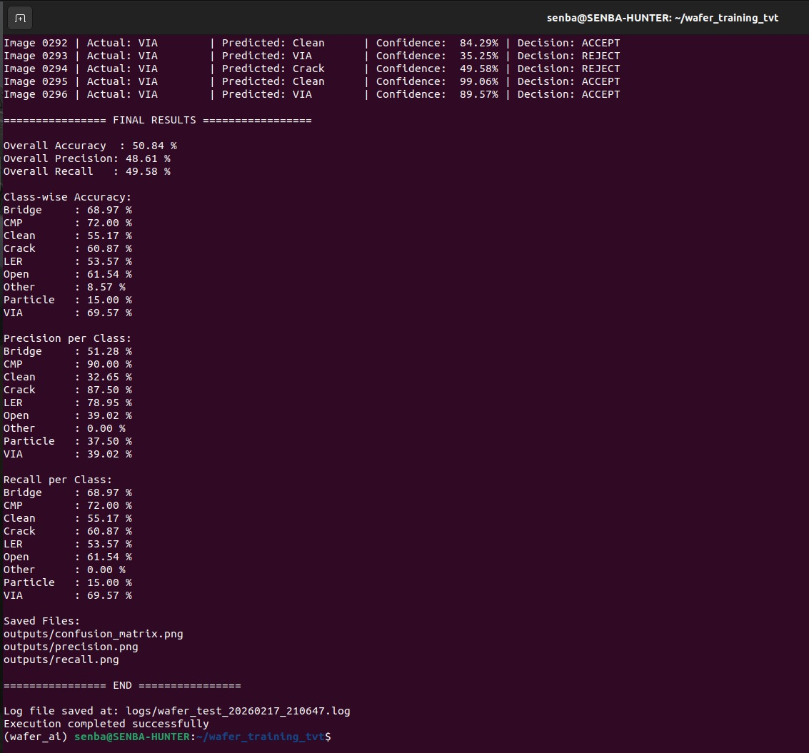
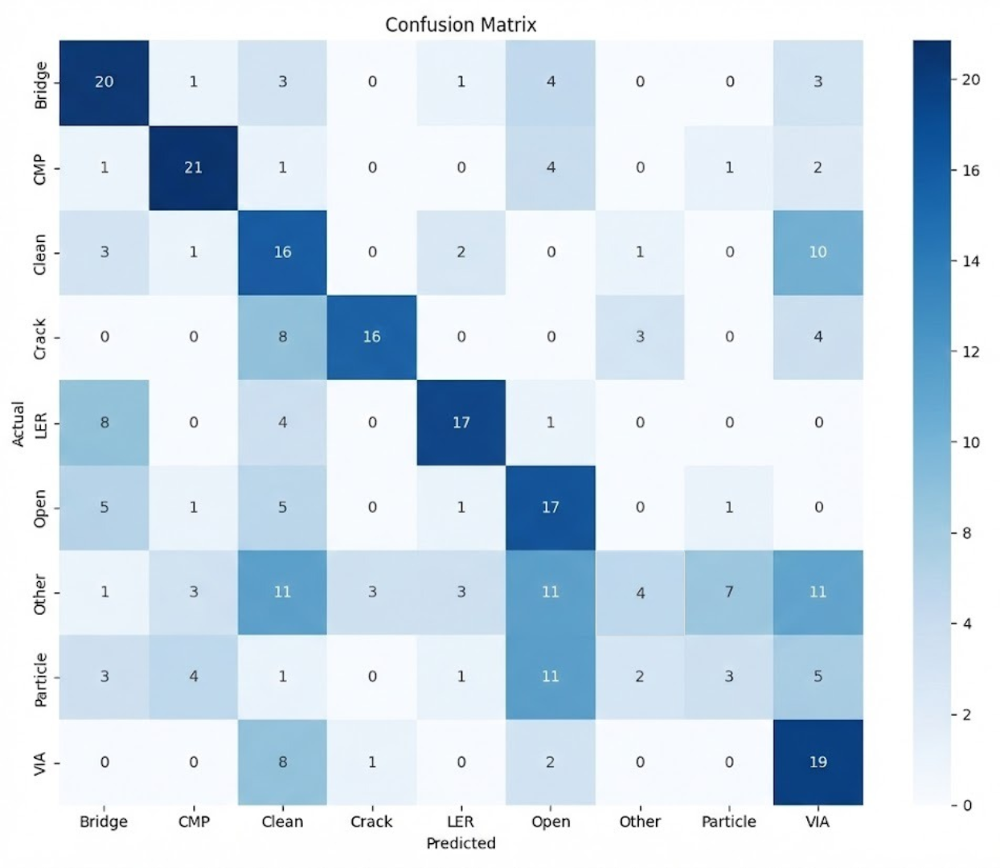
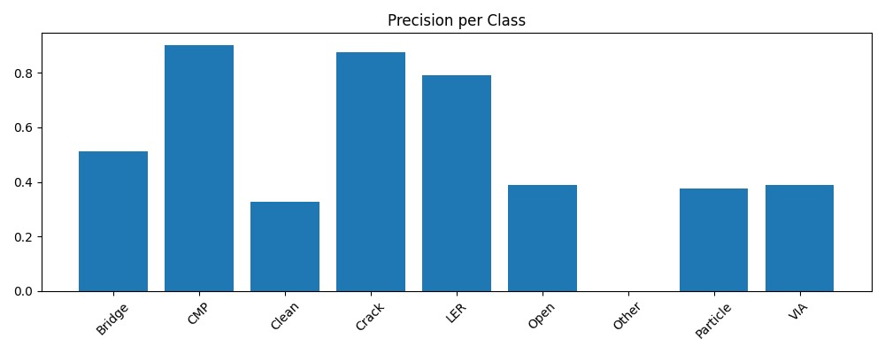
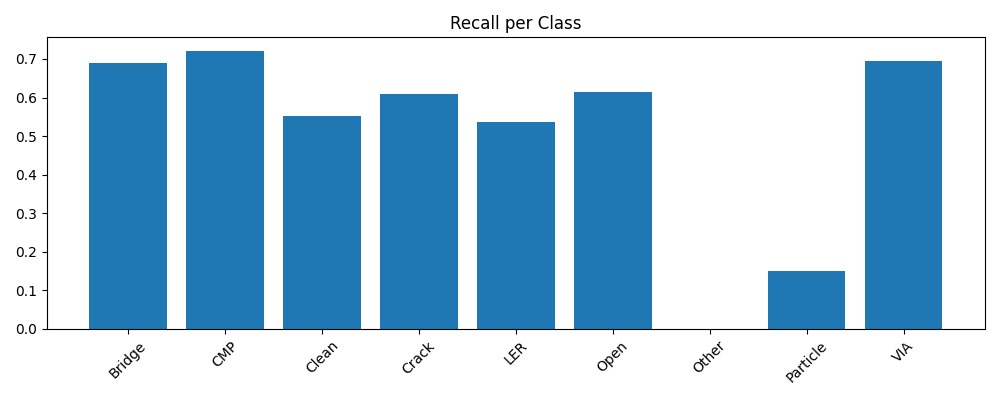

# 🔍 Phase-2 Inference – Hackathon Test Dataset Evaluation

This repository contains the inference pipeline used to evaluate the
**Phase-1 submitted trained wafer defect classification model** on the
official `hackathon_test_dataset` provided for Phase-2 of the
DeepTech Hackathon 2026.

---

## 📌 Compliance Statement

- The model used for inference is **exactly the same trained model submitted in Phase-1**.
- **No retraining** was performed.
- **No weight modification** was performed.
- Only **image resizing** was applied as per Phase-2 guidelines.
- No additional preprocessing, augmentation, or normalization was introduced.

---

## 📄 File Description

- `test_hackathon_dataset.py`
  Main inference script used for evaluation on the full test dataset.

The script performs:

1. Model loading (Phase-1 submitted model)
2. Image resizing to required input dimension
3. Forward inference
4. Metric computation

---

## ⚙️ Inference Workflow

1. Load the trained Phase-1 model
2. Resize input images to required input size (e.g., 224 × 224)
3. Perform forward pass
4. Generate predictions
5. Compute evaluation metrics

## Inference Techniques Applied in the Model

1.Mapping 
- We applied mapping only on the model output probabilities to convert them into the required label format (for example, mapping prediction scores to class labels like 0 and 1).

2.Thresholding 
- We used a 0.6 threshold.
- If the predicted probability ≥ 0.6 → classified as Positive (1)
- If the predicted probability < 0.6 → classified as Negative (0)

3.Model Reloading
- Reloading the trained model weights
- Restore model structure.
- Set to evaluation mode for inference.

---

## 📊 Final Results

- Accuracy   - 50.84 %
- Precision  - 48.61 %
- Recall     - 49.58 %
- Confusion Matrix , recall , precision png generated
<div align="center">
  
</div>

All metrics are computed on the complete `hackathon_test_dataset`.

---

## 📁 Repository Structure
```bash
WaferWise-Edge-Wafer-Defect-Classification/
│
├── models/
│   ├── best_model.pth
│   ├── readme.md
│   ├── wafer_mobilenetv3_tvt.onnx
│   └── wafer_mobilenetv3_tvt.onnx.data
WaferWise-Edge-Wafer-Defect-Classification/
│
├── /test_inference_phase_2
│   ├── test_hackathon_dataset.py
│   ├── confusion_matrix.png
│   ├── precision.png
│   ├── recall.png
│   └── Readme.md
```
---

## 🚀 How to Run

```bash

python test_hackathon_dataset.py

```
<div align="center">
  
</div>
<div align="center">
  
</div>
<div align="center">
  
</div>
Ensure the model path inside the script points to the Phase-1 submitted model.
---

## 📝 Important Notes

The model architecture and class mapping remain unchanged from Phase-1.

Any class mismatch between training and test dataset is handled during evaluation
for confusion matrix alignment only, without modifying the model.

This repository contains only inference-related code as required for Phase-2.


