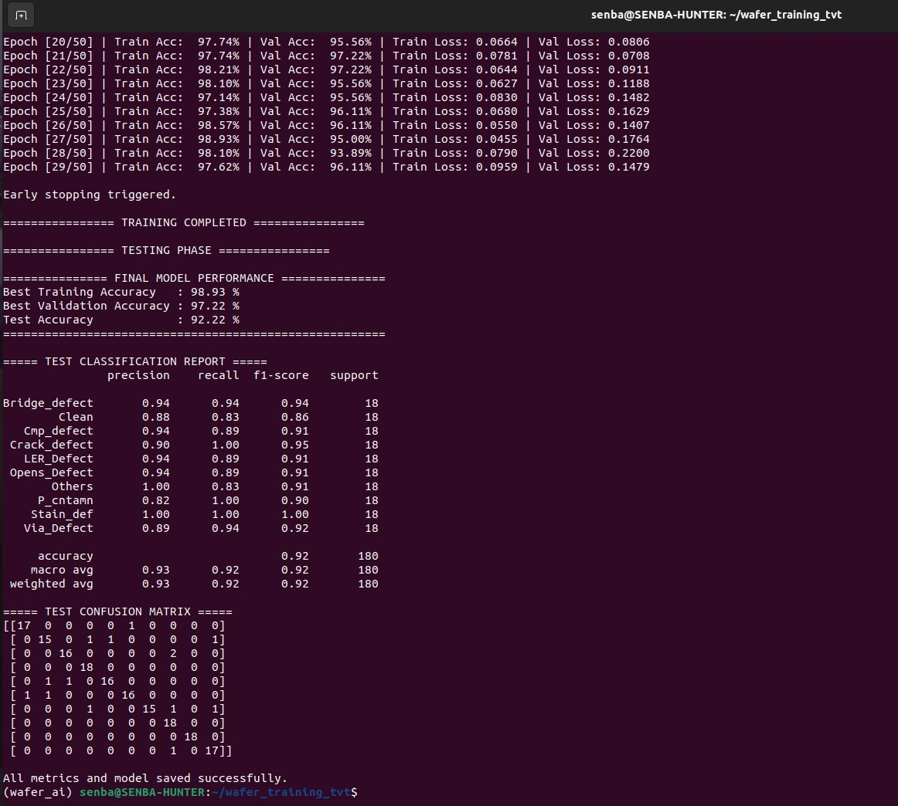

# 🏋️ Model Training – MobileNetV3-Small

This directory contains the complete PyTorch training pipeline used to train the
wafer defect classification model and export it to ONNX for edge deployment.

The training flow is optimized for **accuracy**, **early convergence**, and
**edge portability**.

---

## 📁 Files in this Folder

```text
training/
├── train_wafer_mobilenet_tvt.py
├── export_to_onnx.py
```
## 📄 File Descriptions
train_wafer_mobilenet_tvt.py
End-to-end training script that:
Loads wafer defect images

Trains MobileNetV3-Small using transfer learning

Performs Train / Validation / Test split

Applies early stopping

Evaluates performance on the test set

Generates classification report & confusion matrix

Saves best model and training metrics

export_to_onnx.py
Script used to export the trained PyTorch model to ONNX format
with external data support for edge deployment.

outputs/
Directory containing all generated model artifacts and metrics.

## 🖥️ System Requirements
OS: Ubuntu 20.04 / 22.04

Python: 3.9+

CPU training supported (GPU optional)

Internet connection (for pretrained weights)

## 📦 Step 1: Clone Repository
```bash
git clone https://github.com/PRIY4DH4RS4N-D/WaferWise-Edge-Wafer-Defect-Classification
cd WaferWise-Edge-Wafer-Defect-Classification
```
## 🧪 Step 2: Create Virtual Environment
```bash
sudo apt update

sudo apt install python3-pip python3-venv -y

python3 -m venv wafer_ai

source wafer_ai/bin/activate
```

## 📥 Step 3: Install Dependencies
```bash
pip install torch torchvision torchaudio

pip install numpy matplotlib scikit-learn

pip install onnx onnxruntime onnxscript
```

⚠️ All packages must be installed inside the virtual environment.

## 📂 Step 4: Dataset Placement (IMPORTANT)
The dataset must be placed outside the repository and referenced using an
absolute path inside the training script.

Expected dataset structure:

```text
Copy code
Iesa_datasets/
├── Bridge_defect/
├── Clean/
├── Cmp_defect/
├── Crack_defect/
├── LER_Defect/
├── Opens_Defect/
├── Others/
├── P_cntamn/
├── Stain_def/
└── Via_Defect/
Each folder contains grayscale wafer images.
```
## ⚙️ Step 5: Training Configuration (Inside Script)
Key settings used in train_wafer_mobilenet_tvt.py:

Input size: 224 × 224

Channels: Grayscale → replicated to 3 channels

Model: MobileNetV3-Small (pretrained)

Number of classes: 10

Loss function: CrossEntropyLoss

Optimizer: Adam (lr = 1e-4)

Epochs: 50 (early stopping enabled)

Batch size: 16

Data split: Train / Validation / Test (TVT split)

## 🚀 Step 6: Run Training
Activate the virtual environment (if not already):

```bash
source wafer_ai/bin/activate
```
Run the training script:

```bash
python train_wafer_mobilenet_tvt.py
```
## 📊 Step 7: Training & Evaluation Outputs
During execution, the script prints:

Epoch-wise training and validation accuracy

Training and validation loss

Early stopping trigger

Final test accuracy

Per-class precision, recall, and F1-score

Confusion matrix on test set

<div align="center">
  
</div>

## 💾 Step 8: Generated Model Artifacts
After successful execution, the following files are generated inside outputs/:

```text
outputs/
├── best_model.pth
├── training_metrics_tvt.pkl
├── wafer_mobilenetv3_tvt.onnx
├── wafer_mobilenetv3_tvt.onnx.data
```
These artifacts are used for:

ONNX inference testing

NXP eIQ edge deployment

Performance analysis and visualization

## 🎯 Observed Performance (Reference)
Best Training Accuracy: ~98.9%

Best Validation Accuracy: ~97.2%

Test Accuracy: ~92.2%

ONNX Inference Latency (CPU): ~10 ms per image

ONNX Model Size: ~296 KB

## 🧠 Notes for Reproducibility
Folder names define class labels automatically

Class order is alphabetical and must not be changed

Same preprocessing is used for training and inference

ONNX export uses external data format for edge compatibility

## ✅ Training Status
This pipeline produces a fully trained, evaluated, and
edge-ready wafer defect classification model suitable for
industrial inspection and embedded AI deployment.
